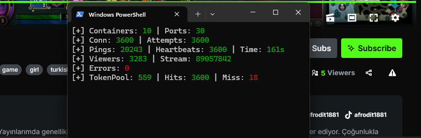
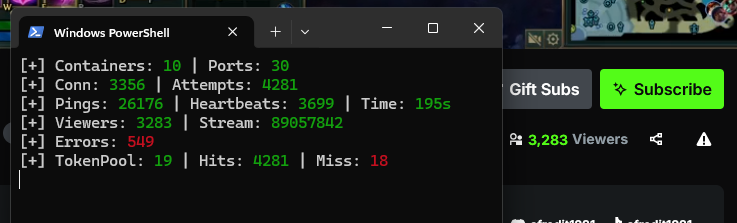

# Kick Viewer Bot (Tor Proxy)

THIS IS FOR EDUCATİONAL PURPOSES ONLY

Tor-based viewer bot for Kick.com. Uses Docker containers to run multiple Tor instances and increases viewer count through WebSocket connections.

## Table of Contents

- [Requirements](#requirements)
- [Installation](#installation)
- [Files](#files)
- [Usage](#usage)
- [Screenshots](#screenshots)
- [Performance Comparison](#performance-comparison)
- [Customization](#customization)
- [Troubleshooting](#troubleshooting)
- [Stats Explained](#stats-explained)
- [How It Works](#how-it-works)

## Requirements

- Python 3.8+
- Docker Desktop
- Windows 10/11

## Installation

### 1. Install Docker Desktop

Download and install Docker Desktop from the official website:
https://www.docker.com/products/docker-desktop/

After installation:
- Start Docker Desktop
- Wait for it to fully initialize (whale icon in system tray should be stable)
- Make sure WSL 2 backend is enabled (Settings > General > Use WSL 2 based engine)

### 2. Install Python Dependencies

```bash
git clone https://github.com/furkanigsiz/kick-viewer-torproxy.git
cd kick-viewer-torproxy
pip install -r requirements.txt
```

Required packages:
- aiohttp
- aiohttp-socks
- tls_client

## Files

| File | Description | Tor per Container |
|------|-------------|-------------------|
| `kick-single.py` | Simple version, 1 Tor instance per container | 1 |
| `kick-multi6.py` | Multi-Tor version, 6 Tor instances per container | 6 |
| `kick-multi3.py` | Lightweight version, 3 Tor instances per container | 3 |

## Usage

### kick-multi6.py (Recommended)

Best balance between performance and stability. 15 containers = 90 Tor circuits.

```bash
python kick-multi6.py
```

1. Enter container count (e.g. 15)
2. Enter base port (default: 19050) you can skip this step if you want to use default ports
3. Wait 45 seconds for Tor bootstrap
4. Enter channel name

Example output:
```
=== Kick Viewer Bot (Multi-Tor Docker) ===

[*] Building multitor image...
[*] Token settings: Pool=500, Wait=150, Producers=60
[*] Creating 15 containers (6 Tor instances each)...
[*] Container 1/15 ports 19050-19055... OK
[*] Container 2/15 ports 19056-19061... OK
...
[+] Created 15 containers with 90 total ports
[*] Waiting 45s for Tor instances to bootstrap...


```

### kick-multi3.py (Lightweight)

Uses less RAM per container. Good for systems with limited resources. 30 containers = 90 Tor circuits.

```bash
python kick-multi3.py
```

### kick-single.py (Simple)

One Tor instance per container. Most stable but requires more containers for same performance.

```bash
python kick-single.py
```

## Performance Comparison

| Version | For 90 Ports | RAM Usage | Stability | Recommended For |
|---------|--------------|-----------|-----------|-----------------|
| kick-single.py | 90 containers | ~9 GB | Very stable | Testing |
| kick-multi6.py | 15 containers | ~2 GB | Stable | Production |
| kick-multi3.py | 30 containers | ~3 GB | Stable | Low RAM systems |

## Screenshots

### Before (Starting)


### After (Running)


## Expected Results

With 15 containers (90 ports) using kick-multi6.py:
```
[+] Containers: 15 | Ports: 90
[+] Conn: 5994 | Attempts: 8457
[+] Pings: 51182 | Heartbeats: 8351 | Time: 323s
[+] Viewers: 3220 | Stream: 87792781
[+] Errors: 64
[+] TokenPool: 16 | Hits: 8458 | Miss: 19
```

## Customization

### Ports Per Container

In `kick-multi6.py` or `kick-multi3.py`:

```python
PORTS_PER_CONTAINER = 6  # Change to your desired value
```

After changing, update the corresponding Dockerfile and start-tor script:

**Dockerfile.multitor:**
```dockerfile
EXPOSE 9050-9055  # Adjust based on port count
```

**start-tor.sh:**
```bash
for i in 0 1 2 3 4 5; do  # Adjust based on port count
```

### Connection Settings

```python
CONNS_PER_PORT = 120      # Max connections per port
TOKEN_POOL_SIZE = 500     # Token pool size
TOKEN_PRODUCERS = 60      # Token producer thread count
PONG_TIMEOUT = 180        # Connection timeout (seconds)
```

## Troubleshooting

### Docker Desktop Not Running

```
[!] Docker not found!
```

Solution: Start Docker Desktop and wait for it to fully initialize.

### Tor Bootstrap Error

```
Problem bootstrapping. Stuck at 50% (loading_descriptors)
```

Solution: 
- Reduce container count
- Increase wait time in the script
- Check your internet connection

### Token Pool Draining Fast

If TokenPool drops to 0 frequently, increase `TOKEN_PRODUCERS` value.

### Connections Not Increasing

Check `CONNS_PER_PORT` value. Default is 120, increase if needed.

### High Memory Usage

Switch to `kick-multi3.py` or reduce container count.

## Stats Explained

```
[+] Containers: 15 | Ports: 90
[+] Conn: 5994 | Attempts: 8457
[+] Pings: 51182 | Heartbeats: 8351 | Time: 323s
[+] Viewers: 3220 | Stream: 87792781
[+] Errors: 64
[+] TokenPool: 16 | Hits: 8458 | Miss: 19
```

- **Containers**: Running Docker containers
- **Ports**: Total Tor SOCKS ports available
- **Conn**: Active WebSocket connections
- **Attempts**: Total connection attempts
- **Pings**: Keep-alive pings sent
- **Heartbeats**: Successful handshakes
- **Viewers**: Viewer count shown by Kick
- **Errors**: Failed connection count
- **TokenPool**: Ready tokens in pool
- **Hits/Miss**: Token pool hit/miss ratio

## Cleanup

Containers are automatically cleaned up when you press Ctrl+C. 

For manual cleanup:

```bash
docker rm -f $(docker ps -aq --filter "name=multitor")
docker rm -f $(docker ps -aq --filter "name=tor_viewer")
```

## How It Works

1. Script creates Docker containers running Tor proxy
2. Each container exposes SOCKS5 ports for Tor circuits
3. Token producers fetch viewer tokens through Tor
4. WebSocket connections are established to Kick's servers
5. Each connection counts as a viewer
6. Ping messages keep connections alive

## License

MIT

---

If you found this project useful, don't forget to give it a star.
